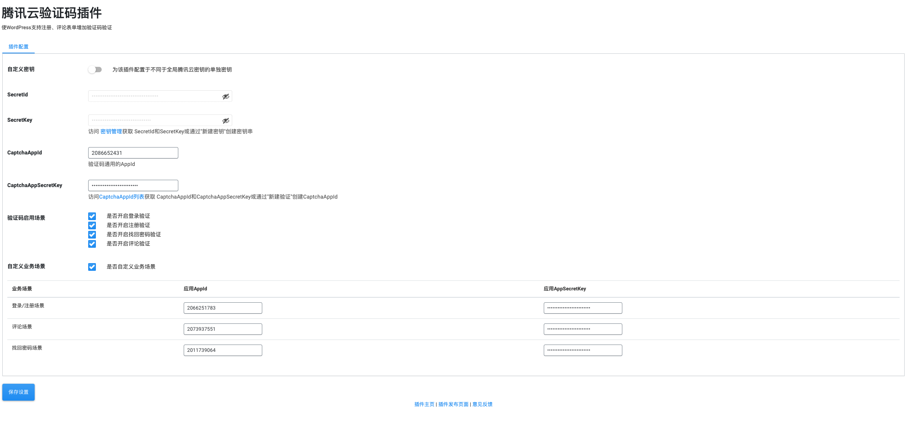
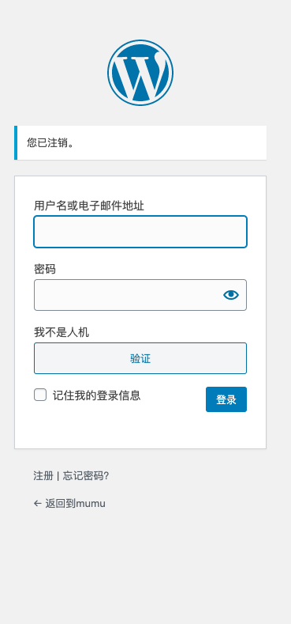
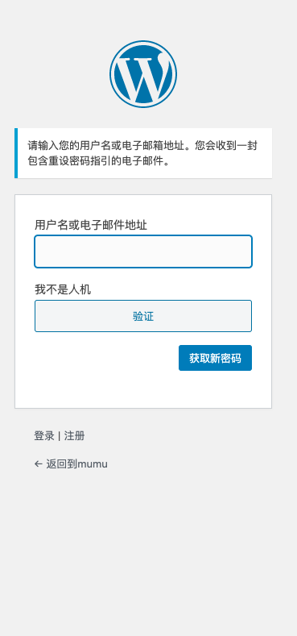
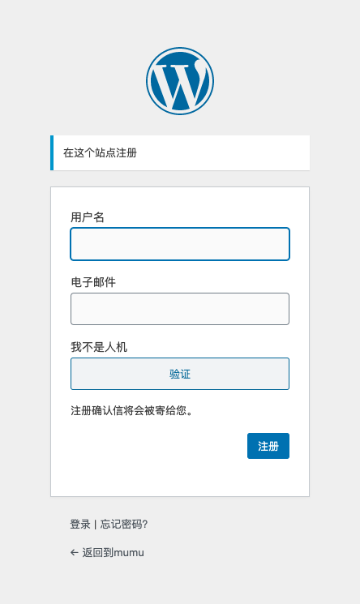
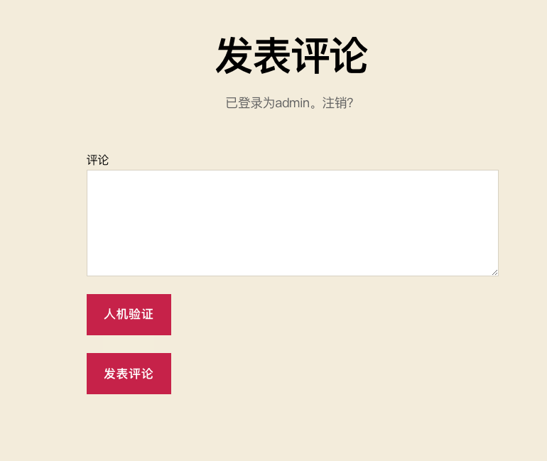

# 腾讯云验证码插件

## 1.插件介绍

> tencentcloud-captcha插件是一款腾讯云研发的，提供给WordPress站长使用的官方插件。实现网站注册、评论、登录、找回密码模块的验证码验证，防止机注册、垃圾评论及垃圾邮件。

| 标题       | 名称                                                         |
| ---------- | ------------------------------------------------------------ |
| 中文名称   | 腾讯云验证码（CAPTCHA）插件                                  |
| 英文名称   | tencentcloud-captcha                                         |
| 最新版本   | v1.0.1 (2020.12.11)                                          |
| 适用平台   | [WordPress](https://wordpress.org/)                          |
| 适用产品   | [腾讯云验证码](https://cloud.tencent.com/document/product/1110/36334) |
| GitHub项目 | [tencentcloud-wordpress-plugin-captcha](https://github.com/Tencent-Cloud-Plugins/tencentcloud-wordpress-plugin-captcha) |
| 文档中心   | [春雨文档中心](https://openapp.qq.com/docs/Wordpress/captcha.html) |
| 主创团队   | 腾讯云中小企业产品中心（SMB Product Center of Tencent Cloud） |
| 反馈地址   | 请通过[咨询建议](https://support.qq.com/products/164613)向我们提交宝贵意见  |

## 2.功能特性

- 支持在注册表单中增加验证码

- 支持在评论表单中增加验证码

- 支持用户自定义业务场景

- 支持登录表单增加验证码

- 支持找回密码表单增加验证码

  

## 3.安装指引

### 3.1.部署方式一：通过GitHub部署安装

> 1. git clone https://github.com/Tencent-Cloud-Plugins/tencentcloud-wordpress-plugin-captcha
> 2. 复制tencentcloud-captcha 文件夹 到wordpress安装路径/wp-content/plugins/文件夹里面

### 3.2.部署方式二：通过WordPress插件中心安装

> 1. 访问 WordPress插件中心 https://wordpress.org/plugins/search/tencentcloud-captcha
> 2. 下载压缩包,解压缩到wordpress安装路径/wp-content/plugins/文件夹里面

### 3.3.部署方式三：通过WordPress站点安装

> 1. 登录WordPress站点后台管理页，点击插件菜单栏
> 2. 点击页面中的安装插件，在搜索框中输入腾讯云验证码 插件名称
> 3. 点击搜索按钮找到对应插件，点击“现在安装/现在更新”完成安装。

## 4.使用指引

### 4.1. 页面功能介绍

> 插件配置页面，需要配置插件的相关信息及勾选需要开启的模块。

> 登录页面开启验证码效果。

> 忘记密码页面开启验证码效果。

> 注册页面开启验证码效果。

> 评论页面开启验证码效果。

### 4.2. 名词解释

- **自定义密钥**：插件提供统一密钥管理，在多个腾讯云插件时可以共享SecretId和SecretKey，支持各插件自定义密钥。
- **SecretId**：在腾讯云云平台API密钥上申请的标识身份的 SecretId,用于身份验证。详情参考[腾讯云文档](https://cloud.tencent.com/document/product)。
- **SecretKey**：在腾讯云云平台API密钥上申请的标识身份的SecretId对应的SecretKey，用于身份验证。详情参考[腾讯云文档](https://cloud.tencent.com/document/product)。
- **CaptchaAppId**： 在腾讯云短信验证码控制台应用的应用ID，该应用ID默认应用全部场景。详情参考[腾讯云文档](https://cloud.tencent.com/document/product)。
- **CaptchaAppSecretKey**： 在腾讯云短信验证码控制台应用的密钥，需和应用ID匹配。详情参考[腾讯云文档](https://cloud.tencent.com/document/product)。
- **验证码启用场景**：配置腾讯云验证码在WordPress站点中登录、评论、注册、找回密码场景中开启。
- **自定义业务场景**： 腾讯云短信验证码提供四种业务场景，用户可根据WordPress验证场景自由匹配腾讯云验证码场景。

## 5.获取入口

| 插件入口          | 链接                                                         |
| ----------------- | ------------------------------------------------------------ |
| GitHub            | [link](https://github.com/Tencent-Cloud-Plugins/tencentcloud-wordpress-plugin-captcha) |
| WordPress插件中心 | [link](https://wordpress.org/plugins/search/tencentcloud-captcha) |

## 6.FAQ

## 7.GitHub版本迭代记录

### 2020.12.11 tencentcloud-wordpress-plugin-captcha v1.0.1
- 支持在windows环境下运行

### 2020.6.23 tencentcloud-wordpress-plugin-captcha v1.0.0
- 支持在注册表单中增加验证码
- 支持在评论表单中增加验证码
- 支持用户自定义业务场景
- 支持登录表单增加验证码
- 支持找回密码表单增加验证码

